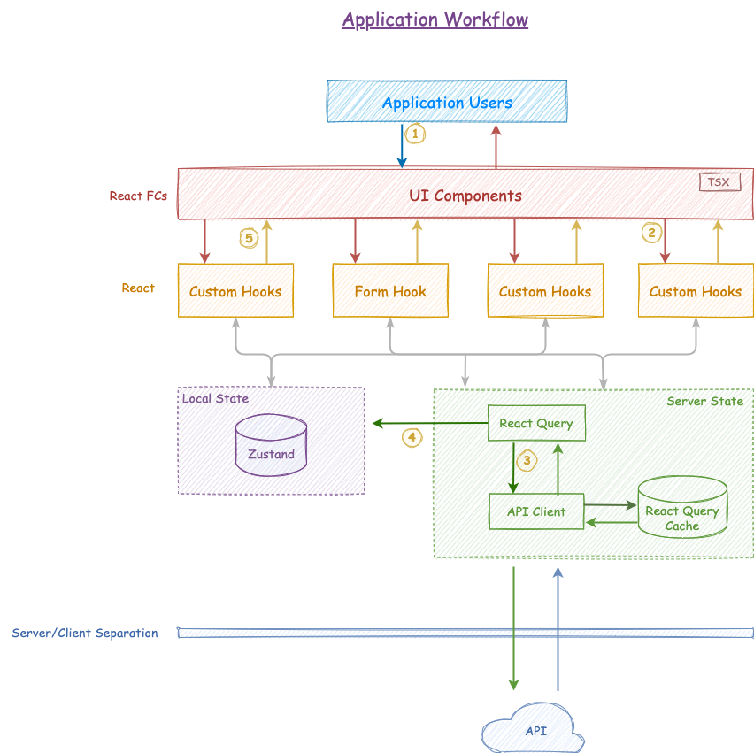

# web-app

The `web-app` folder houses the micro frontend application, a modular component designed to operate independently. This folder contains all the necessary files and configurations to run the frontend application seamlessly.

----

**Table of content**

- [Application Workflow](#application-workflow)
- [KickStart](#kickstart)
  - [Bootstrap](#bootstrap)
  - [Running Test](#running-tests)
  - [Linting](#linting)
  - [Build](#build)
  - [Running production build](#running-production-build)
- [General Architecture](#general-architecture)
- [SASS Architecture](#sass-architecture)
  - [CSS Class Structure](#css-class-structure)
- [Tech Stack](#tech-stack)

## Application Workflow


1. `Rendering` - Each time a user triggers an action with the application, the rendering process of React functional components initiates. 
2. `Delegate` - These functional components delegate the action to React custom hooks, enabling access to the application's state and execution of the corresponding logic.
3. `Data Fetching` - The custom hooks utilize React Query to fetch data from an API.
4. `State Management` - Following data retrieval, the hooks update the local state or store as defined by Zustand, incorporating both state variables and actions.
5. `Re-rendering` - The React functional components defined by the updates state triggers a re-render, displaying the updated data on the screen for the end user.

## KickStart

### Bootstrap

Install dependencies. This can be done here, but really should done in the repository root directory via `pnpm bootstrap`.

```
pnpm install
```

Start the app in development mode pointing to a running bff-mock package. Ensure the constant `base` variable is correct in `vite.config.ts`.

```
pnpm start
```

## Running tests

Unit tests in this package are powered by:

* [Jest](https://facebook.github.io/jest/)
* [React Testing Library](https://testing-library.com/docs/react-testing-library/intro/)
* [Pact](https://github.com/pact-foundation/pact-js)

Run all tests. This also outputs coverage.

```
pnpm test
```

Run unit tests.

```
pnpm test:unit
```

Run unit tests in watch mode.

```
pnpm test:unit:watch
```

Run pact tests.

```
pnpm test:pact
```

Run pact tests in watch mode.

```
pnpm test:pact:watch
```

## Linting
All code in this folder is linted using:

* [ESLint](https://eslint.org/) - Lints JavaScript/Typescript
* [StyleLint](https://stylelint.io/) - Lints CSS & SCSS

Lint all JavaScript/Typescript and SCSS in all packages.
```
pnpm lint
```

## Build

Perform a production build into `/dist`.

```
pnpm build
```

## Running production build

Run preview of the production build in the `/dist`.

```
pnpm preview
```

## General Architecture

This project has a number of folders under `/src`.

* `/api` - Place any API calls under here, pact contracts are derived from these calls
* `/assets` - Any static assets that are imported and loaded via webpack are placed in here such as SVG icons
* `/utils` - Small, concise helper functions and constants
* `/components` - The bulk of the application will be split into components that provide clear boundaries of functionality.
* `/scss` - The ITCSS SASS project powering the styles of the project
* `/store` - The applications state is managed in here. It consists of a Zustand store.

## SASS Architecture

This project uses an ITCSS architecture. This consists of a 7 layers. These layers are compiled in order, each contains more and more specific CSS. This reduces the impact of CSS specifity becoming an issue.

* **Settings** - Global configuration and variables (outputs no CSS).
* **Tools** - Mixins and functions (outputs no CSS).
* **Generic** - High level styles such as resets and normalize.css.
* **Elements** - Base HTML styling.
* **Objects** - Common non-cosmetic structural design patterns. These are used for layout and should not produce any visuals.
* **Components** - Specific costmetic elements of UI.
* **Utilities** - Helpers and overrides, these should be atomic and imutable via the use of `!important`.

### CSS Class Structure

Structure your CSS classes as follows:

```
// Position
position: absolute;
left: 0;
...

// Display and box model
display: block;
padding: 1rem;
margin: 1rem;
...

// Typography
font-size: 1rem;
font-weight: 500;
...

// Cosmetic
color: #222;
background-color: #fff;
...

// Native interaction
cursor: pointer;
pointer-events: none;
...

// Media queries
@media (min-width: 1000px) {
  ...
}
```

## Tech Stack

* [Vite](https://vitejs.dev/) - Builds the web app
* [Typescript](https://www.typescriptlang.org/) - Programming language that builds on Javascript with added syntax of types.
* [React](https://react.dev/) - The core framework powering the UI
* [Hooks](https://react.dev/reference/react/hooks) - Functions that let you “hook into” React state and lifecycle features from function components.
* [React Query](https://tanstack.com/query/v3/) - Tool for Data fetching
* [GraphQl](https://www.npmjs.com/package/graphql-request) -  GraphQl client library
* [Form-Hook](https://react-hook-form.com/) - Performant, flexible and extensible forms with minimal re-renders
* [Zustand](https://zustand-demo.pmnd.rs/) - Light weight state management library 
